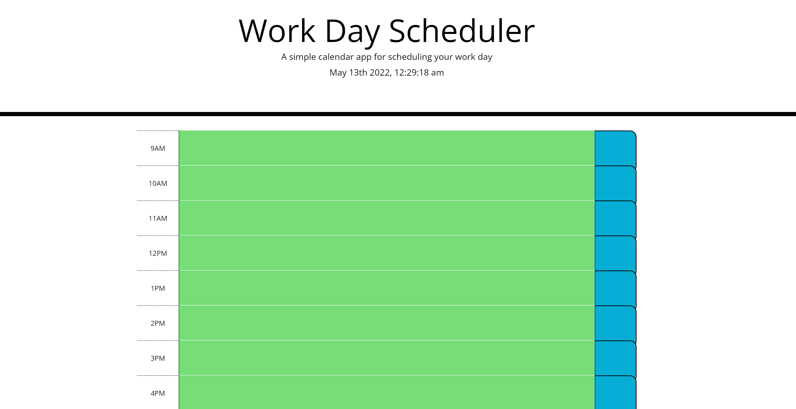
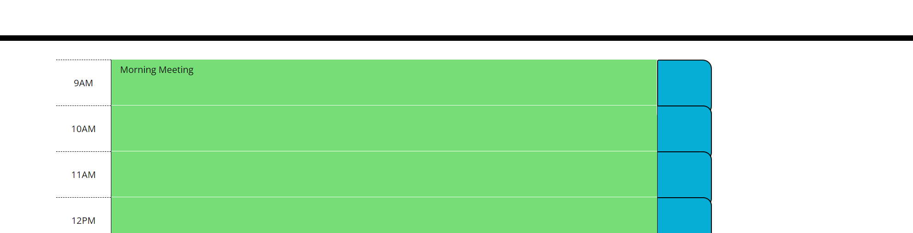

When designing this program I would aiming to meet all necessary criteria while utilizing the code we have learned while covering Javascript. Also, wanted to generate something what would be easy for the user to understand how the program worked and users were able to successfully utilize the planner

It solves the problem of of allowing a user to have a daily planner that saves their information upon page refresh. The user can add/remove information as they please. Each line will be color coded by hour. Past, Present, and Future.

Utilized j query for this code for the first time. It was fun to use and learn an additional way to reach the same results. I utilized a each function to cycle through each time field. This was a new process for me and was a learning proces. 

Some screen shots of the program,

Main Page User Sees at Load:

User Task Input

URL: https://jmak21203.github.io/DailyPlanner/